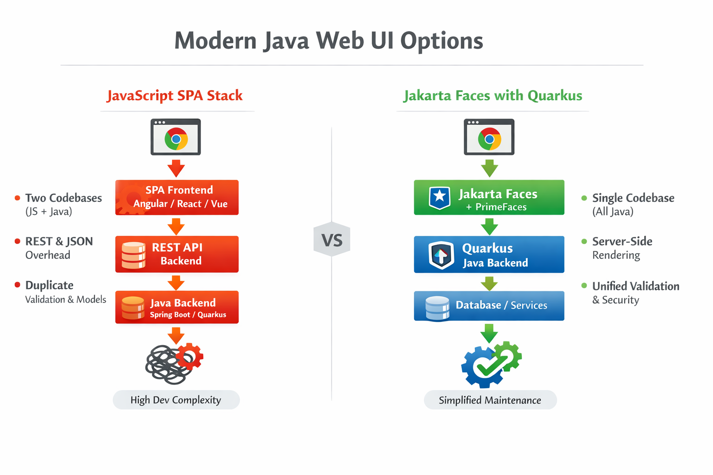
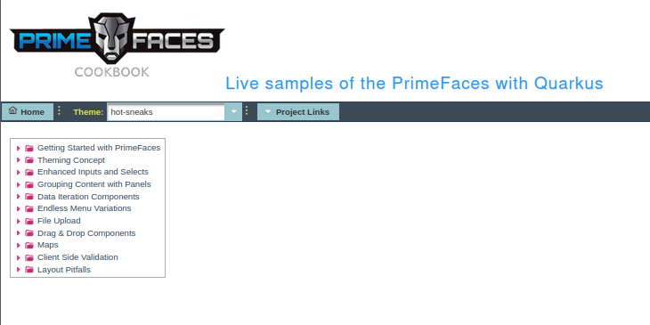

# Rethinking Java Web UIs with Jakarta Faces and Quarkus

Nowadays, Java enterprise applications often default to Angular, React, or Vue for 
the frontend. But for this kind of applications, the most natural UI framework 
already exists in the Java ecosystem: Jakarta Faces. 

Do enterprise grade Java Applications really need heavy JavaScript libraries ?
This is the question to which we'll be trying to answer here.

Modern Java enterprise applications tend to follow a familiar pattern: a Java 
backend exposing REST APIs and a JavaScript/TypeScript frontend built with some
library like Angular, React, or Vue. This architecture has become so standard
that we rarely question it.

But is this always the most natural choice ? Certainly not, given that the Java
ecosystem already provides a mature, productive, and integrated web UI framework:
Jakarta Faces.

In former times, when dinosaurs still populated the Earth, the enterprise-grade
Java applications development only required the knowledge of a single technology: 
Java with possibly its enterprise extensions, appointed successively as J2EE, 
Java EE, and finally Jakarta EE. Unless it was Spring, the applications and 
services were deployed on Jakarta EE-compliant application servers, like 
Glassfish, Payara, Wildfly, JBoss, WebLogic, WebSphere, etc. These application 
servers were providing out-of-the-box all the required implementations of the 
above-mentioned specifications. Among these specifications, Jakarta Faces (formerly
called JSF: *Java Server Faces*) was meant to offer a framework that facilitates
and standardizes the development of web applications in Java.

The Jakarta Faces history goes back to 2001 to its initial JSR (*Java Specifications
Request*) 127. At that time, another web framework, known under the name of Struts
and available under an Apache open-source license, was widely popular. As it 
sometimes happens in the web frameworks space, the advent of Jakarta Faces was 
perceived by the Apache community as being in conflict with Struts and, this 
alleged conflict was resolved through a long and heavy negotiation process of 
several years, between Sun Microsystems and the Apache community. Finally, Sun 
agreed to lift the restrictions preventing JSRs from being independently implemented
under an open-source license, and the first implementation (RI *Reference Implementation*),
was provided in 2003.

Jakarta Faces was generally well received despite a market crowded with competitors.
Its RI was followed by other implementations over the years, starting with Apache
MyFaces in early 2004 and continuing with RedHat RichFaces in 2005, PrimeTek 
PrimeFaces in 2008, ICEsoft ICEfaces and Oracle ADF Faces in 2009, OmniFaces in
2012, etc. The specifications have evolved as well, from the 1.0 released in 2001
to the 4.1 released in 2024. Hence, more than 20 years of history to advent
to the last Jakarta Faces release 4.1, a part of the Jakarta EE 11 specifications,
named Mojara.

The software history is sometimes convoluted. In 2010, Oracle acquired Sun Microsystems
and became the owner of the Java trademark. All along the time period that they 
were under the Oracle stewardship, the Java EE specifications were in a kind of 
status quo before becoming Eclipse Jakarta EE. The company didn't really manage
to set up a dialogue with users, communities, work groups, and all those involved
in the recognition and promotion of the Java enterprise-grade services. Their 
evolution requests and expectations were ignored by the editor, who didn't know
how to deal with their new responsibility as the Java/Jakarta EE owner. In such
a way that, little by little, this has led to a guarded reaction from software 
architects and developers, who began to prefer and adopt alternative technological
solutions.

While trying to find alternative solutions to Jakarta EE and to remedy issues like
the apparent heaviness and the expensive prices of application servers, many 
software professionals have adopted Spring Boot as a development platform. Other
solutions, closer to real Jakarta EE alternatives, have emerged as well and, among
them, Netty, Quarkus, Micronaut, Helidon are the best-known and most popular. All these 
solutions were based on a couple of software design principles, like single concern,
discrete boundaries, transportability across runtimes, auto-discovery, etc., 
which were known since the dawn of time. But because the software industry 
continuously needs new names, the new name that has been found for these alternative
solutions was "microservices."

More and more microservice architecture-based applications have appeared during the
next few years, to such an extent that the word "microservice" became one of the most 
common buzzwords in the software industry. In order to optimize and standardize the
microservices technology, the Eclipse Foundation decided to apply to microservices
the same process that was used to design the Jakarta EE specifications. The Eclipse
MicroProfile was born.

But all these convolutions have definitely impacted the web framework technologies.
While the high majority of the Java enterprise-grade applications were using 
Jakarta Faces for their web tier, switching from a software architecture based on
Jakarta EE-compliant application servers to microservices resulted in a phasing-out
of these architectures in favor of some more lightweight ones, often based on 
Eclipse Microprofile specifications. And since Jakarta Faces components needed 
an application server to be deployed on, or at least a servlet engine, other 
lighter alternatives, based on JavaScript or TypeScript libraries, like Angular,
Vue, ExtJS, jQuery, and others, have been adopted to make up for its absence and
to become the front-end preferred stack.

Such applications generally require two development teams:
  - A front-end team specialized in JavaScript / TypeScript, Angular, CSS, and HTML development, using Node.js as a deployment platform, NPM as a build tool, Bower as a dependency management, Gulp as a streaming system, Karma and Jasmine for testing, WebPack as a code bundler, and probably many others.
  - A back-end team specialized in Java development with Jakarta EE / Eclipse Microprofile specifications, including but not limited to MP Config, MP REST Client, MP OpenAPI, MP Health, etc. or Jakarta REST, Jakarta Persistence, Jakarta Messaging, Jakarta Security, Jakarta JSON Binding, etc.

Building enterprise-grade project teams became too difficult as it 
required at least two categories of profiles and, given the technology's complexity,
the mentioned profiles should have better been seniors. Hence, the software 
industry has been 
facing a shortage of qualified developers which determined several organizations
to favor full-stack JavaScript / TypeScript enterprise applications. This has 
lead to kind of unnatural and convoluted architectures, where the back-ends were
written in a browser dedicated programming language, with all the issues that 
this choice implied, like performance, security, maintainability, etc. 

This situation sharply contrasts with what happened in the former times when the
front-end could have been implemented using Jakarta Faces and, hence, a single 
Java development team was able to take charge of such an enterprise-grade project.
Jakarta Faces is a great web framework whose implementations offer hundreds of 
ready-to-use widgets and other visual controls. Compared with Angular, where the
visual components are a part of external libraries, like Material, NG-Bootstrap,
Clarity, Kendo, Nebular, and many others, Jakarta Faces implementations not only
provide ways more widgets and features but also are part of the official JSR 372
specifications and, in this respect, they are standard, as opposed to the mentioned
libraries, which evolve with their authors prevailing moods, without any guarantee
of consistency and stability.

The figure below shows a two typical architectures:

  - an SPA (*Single Page Application*) architecture based on a JavaScript front-end, and a Java backend exposing REST APIs. As you can see, it requires two codebases and, probably, two separate development teams, one for the front-end and one for the back-end, and it also requires a lot of different technologies and tools.
  - a classical Java enterprise-grade application built with Jakarta Faces and Quarkus. The frontend is implemented using Jakarta Faces, which provides a rich set of components and features for building complex web applications. The backend is implemented using Quarkus, which provides excellent support for Jakarta Faces, via its [PrimeFaces extension](https://quarkus.io/extensions/io.quarkiverse.primefaces/quarkus-primefaces/), and allows for fast development and efficient performance.

One of the criteria that has formed many organizations' decision basis to switch
from Jakarta Faces web applications to JavaScript/TypeScript frameworks was 
client-side rendering. It was considered that the server-side rendering, which 
is the way the Jakarta Faces works, is less performant than the client-side 
rendering, provided by the browser-based applications. This argument has to be 
taken with a grain of salt:

  - Client-side rendering means rendering pages directly in the browser with JavaScript. All logic, data fetching, templating, and routing are handled by the client. The primary downside of this rendering type is that the amount of JavaScript required tends to grow as an application grows, which can have negative effects on a page's capacity to consistently respond to user inputs. This becomes especially difficult with the addition of new JavaScript libraries, polyfills, and third-party code, which compete for processing power and must often be processed before a page's content can be rendered.
  - Server-side rendering generates the full HTML for a page on the server in response to navigation. This avoids additional round-trips for data fetching and templating on the client since it's handled before the browser gets a response.
  - Server-side rendering generally reduces the time required for the page content to become visible. It makes it possible to avoid sending lots of JavaScript to the client. This helps to reduce a page's TBT (*Total Blocking Time*), which can also lead to a lower average response time as the main thread is not blocked as often during page load. When the main thread is blocked less often, user interactions will have more opportunities to run sooner.
  - With server-side rendering, users are less likely to be left waiting for CPU-bound JavaScript to run before they can access a page. 
  - Server‑side rendering often has a better Time to First Byte (TTFB) and avoids large JavaScript bundles, which can improve perceived performance for many business use‑cases.

Accordingly, the argument consisting of saying that the server-side rendering is
bad while the client-side one would be better is just a myth. 

Consequently, it appears clearly from this analysis that developing Java web 
applications using server-side rendering frameworks, like Jakarta Faces, not 
only leads to more performant applications, but it's also much simpler and less
expensive. This approach doesn't require so many different technology stacks as
its JavaScript/TypeScript-based alternatives. The development teams don't need 
several categories of profiles, and the same developer can directly contribute 
to both the front end and the back end without having to operate any paradigm 
switch. This last argument is all the more important as Java developers, concerned
by things like multi-threading, transaction management, security, etc., aren't 
comfortable when it comes to command programming languages that have been designed
to run in a browser.

The following table summarizes the main differences between the two approaches:

| Criteria | JavaScript/TypeScript-based front-end | Jakarta Faces-based front-end |
| --- | --- | --- |
| Technology stack | Multiple (Angular, React, Vue, etc.) | Single (Jakarta Faces) |
| Development teams | Multiple (front-end and back-end) | Single (full-stack Java) |
| Rendering | Client-side rendering | Server-side rendering |
|Teams expertise | Requires expertise in multiple technologies | Requires expertise in a single technology |
| Performance | Potentially lower due to client-side rendering | Potentially higher due to server-side rendering |
| Complexity | Higher due to multiple technologies and teams | Lower due to single technology and team |
| Maintainability | Potentially lower due to multiple codebases and technologies | Potentially higher due to single codebase and technology |
| Security | Potentially lower due to client-side vulnerabilities | Potentially higher due to server-side control |
| User experience | Potentially lower due to slower initial load and client-side rendering | Potentially higher due to faster initial load and server-side rendering |
| Cost | Potentially higher due to multiple teams and technologies | Potentially lower due to single team and technology |
| Scalability | Potentially higher due to client-side rendering | Potentially lower due to server-side rendering |
| Development speed | Potentially lower due to multiple technologies and teams | Potentially higher due to single technology and team |

So the good news here is that, if like me, you're a nostalgic of Jakarta Faces, 
from now on, you can start implementing your front-ends with it, without the need
for any Jakarta EE-compliant application server. That's because Quarkus, our 
famous Supersonic Subatomic Java platform, provides a Jakarta Faces extension,
allowing you to write beautiful front-ends like in the old good times. 

Quarkus offers fast development mode, cloud‑native performance, and optional 
native compilation, making Jakarta Faces viable even in microservices‑centric 
environments. At 
Melloware Inc., they provide a PrimeFaces extension for Quarkus, as described 
[here](https://github.com/quarkiverse/quarkus-primefaces). You'll find in the mentioned GIT repository a [showcase](https://github.com/melloware/quarkus-faces) application that 
demonstrates, with consistent code examples, how to use every single PrimeFaces
widget. Please follow the guide in the README.md file to build and run the showcase
on both an application server, like Wildfly, and in Quarkus.

I've tested it recently. Those of you having used in the past Jakarta Faces must
certainly remember the book ["Primefaces Cookbook"](https://www.amazon.fr/PrimeFaces-Cookbook-Second-Mert-Caliskan/dp/1784393428),
by Mert Caliskan and Oleg Varaskin, published in 2013, with a 2nd edition in 2015.
This book is one of the most comprehensive and detailed resources about 
Jakarta Faces and PrimeFaces. So, I refactored all the code examples of this 
book to make them work with the latest versions of Quarkus and PrimeFaces. If 
you're interested, you'll find the project [here](https://github.com/nicolasduminil/primefaces-showcase.git).

If you want to give it a try, proceed as follows:

    $ git clone https://github.com/nicolasduminil/primefaces-showcase.git
    $ cd primefaces-showcase
    $ mvn package
    $ java -jar target/quarkus-app/quarkus-run.jar

Then, go to http://localhost:8080 and the following screen will be displayed in your browser:

Here, you are given the chance to exercice most of Jakarta Faces and its 
implementation Mojara and PrimeFaces, and to see how they work in a modern Java
web application built with Quarkus. Just unfold the different nodes in the left-hand
tree and click on the different samples to see them in action. You may change 
the current theme as well by clicking on the "Change Theme" button at the top 
right of the page.

You'll tell me what it feels like there!

